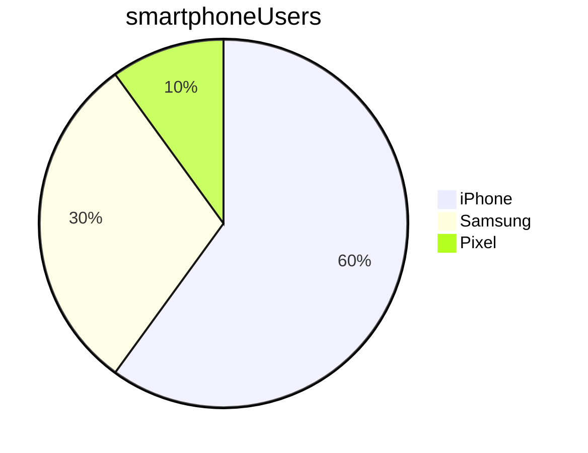

# Markdown basics

Table of contents
* [This is a h1 header](#this-is-a-h1-header)
* [Lists](#lists)

<br>

# This is a h1 header

## This is a h2 header

### This is a h3 header

This is plain text

*This is in italics*
_This is in italics_

**This is in bold**

This is a mix of **bold** and _italics_

> I'll be back
>> Arnold S

## Lists

* item 1
* item 2
  * subitem 1
  * subitem 2

Numbered lists

1. item 1
1. item 2
1. item 3


[Google](https://google.com)

## Marking as code

This is how you print hello to the screen in Python: `print('hello')`

```python
print('hello')
print('hello')
print('hello')
```

## Task list

* [ ] list item not ticked
* [x] list item not ticked

## Tables

Name    | Street        |  Town
--------|---------------|----------
Cathy   | Main St       | Birmingham
John    | Maple Drive   | Stafford




This is the line I forgot
Another line I forgot